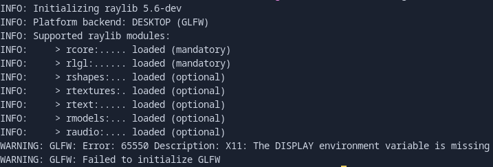

# EightTowers

## Descriere Proiect

- **Problema celor 8 Turnuri** - Să se scrie un program care plasează 8 turnuri pe tabla de șah, astfel încât acestea nu se vor ataca reciproc

### Punctaj Proiect

- Proiectul va fi punctat după cum urmează

1. Implementarea într-un limbaj de programare la alegere
    - Temă de proiect din grupa A: **2 puncte**
    - Temă de proiect din grupa B: **3 puncte**
    - Temă de proiect din grupa C: **4 puncte**
    - Temă de proiect din grupa D: **5 puncte**
2. Fișierele sursă sunt stocate într-un repository Git la alegere (GitHub, GitLab, etc.): **1 punct**
3. Repository-ul are commit-uri distincte, care arată evoluția proiectului întinsă pe o durată de timp rezonabilă: **0,25 puncte**
4. Repository-ul conține fișierul ```.gitignore``` completat corespunzător și nu conține fișiere executabile și alte artefacte de compilare inutile: **0,25 puncte**
5. Documentația (în fișierul **```README.md```** din rădăcina repository-ului)
    - Detalii despre implementare, platforma software utilizată, rezultate, modalitate de rulare, etc.: **0,5 puncte**
    - Documentația este formatată cu Markdown: **0,5 puncte**
    - Documentația afișează cel puțin o captură de ecran: **0,5 puncte**
6. Livrare proiect (deployment)
    - Container Docker stocat cu comenzi manuale (ex. git push) pe o platformă la alegere: **1 punct**
        sau
    - Container Docker creat automat de platformăâ(ex. prin crearea fișierelor de configurare CI/CD): **2 puncte**

## Comentariu asupra Problemei

- Problema celor 8 turnuri este o variație a problemei celor 8 regine, însă cu condiții mai simple
- Conform regulilor de Șah, turnurile se atacă doar pe rânduri și coloane, nu și diagonale.
- Soluția poate fi abordată prin backtracking
- Au fost create 2 versiuni a problemei
    1. Cu afisaj in terminal
        - Poate afisa toate solutiile problemei
    2. Cu Interfata Grafica prin libraria ```raylib.h```
        - Afiseaza o singura solutie random la fiecare click de buton

        

## Listele de Comenzi ale proiectului

1. Rulare Proiect pe Linux
    - Crearea Imaginii Docker
        ```bash
        docker build -t <project-name> .
        ```
    - Run la Container
        1. Rularea imaginii ia in considerare stergerea containerului imediat dupa ce se termina rularea lui
        2. Prima comanda permite Containerului accesul la X11 server

        ```bash
        xhost +local:docker
        docker run --rm -e DISPLAY=$DISPLAY -v /tmp/.X11-unix:/tmp/.X11-unix <projetc-name>
        ```
2. Rulare Proiect pe Windows 10
    - Instalarea unui subdomeniu de Linux pentru rulare
    - Crearea Imaginii Docker
        ```bash
        docker build -t <project-name> .
        ```
    - Run la Container
        ```bash
        docker run --rm -e DISPLAY=$DISPLAY -v /tmp/.X11-unix:/tmp/.X11-unix <project-name>
        ```

## Probleme intampinate

- Intrucat containerul este rulat in baza unei image ce simuleaza o distributie de Linux, apar probleme in momentul rularii motivul fiind o eroare de initializare GLFW
  
- Aceasta a putut fi rezolvata doar prin descarcarea unui subdomeniu linux(Debian)

## Comenzi Pentru Prezentare

1. DockerHub
    ```
    docker pull alinmaslov55/eight_towers:latest
    docker run --rm -e DISPLAY=$DISPLAY -v /tmp/.X11-unix:/tmp/.X11-unix alinmaslov55/eight_towers:latest
    ```
2. Github
    ```
    docker pull ghcr.io/alinmaslov55/eight_towers:latest
    docker run --rm -e DISPLAY=$DISPLAY -v /tmp/.X11-unix:/tmp/.X11-unix ghcr.io/alinmaslov55/eight_towers:latest
    ```
3. Link la Conturi
    - **Github** - https://github.com/alinmaslov55
    - **DockerHub** - https://hub.docker.com/u/alinmaslov55
4. Link la Proiect
    - https://github.com/alinmaslov55/eight_towers.git
